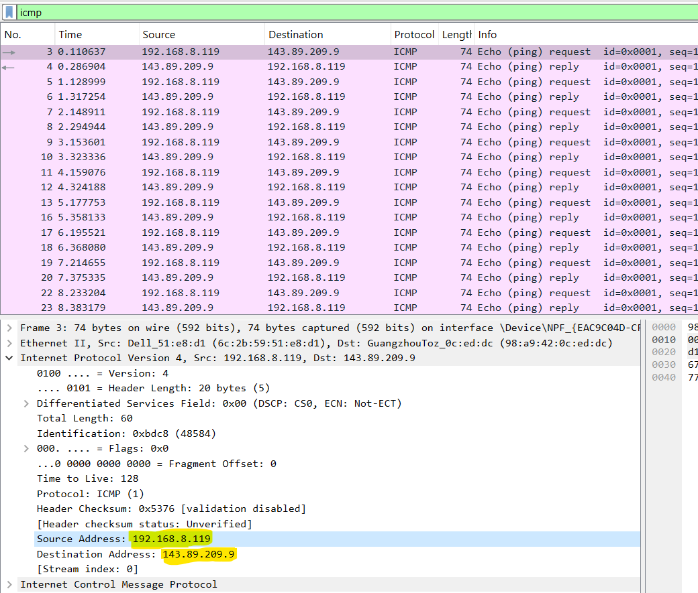

# 🛡️ Network Traffic Analysis: ICMP Encapsulation & Mininet Simulation

## 📖 Executive Summary
This project focuses on **Deep Packet Inspection (DPI)** within a virtualized Software Defined Network (SDN) environment. Using **Mininet** to simulate a multi-segment architecture, I conducted protocol analysis on ICMP traffic to validate the integrity of the **OSI Layer 2 (Data Link)** and **Layer 3 (Network)** headers during local and remote transmissions.

## 🚀 Technical Implementation

### 1. SDN Topology Provisioning
- **Task:** Deployed a custom Python-based **Mininet** topology consisting of four hosts, a switch, and a virtual router (`R1`).
- **Analyst Insight:** Virtualizing the infrastructure allowed for a controlled environment to audit traffic without external interference, ensuring 100% accuracy in MAC-to-IP mapping.

### 2. Local Segment Traffic Dissection (Layer 2)
- **Investigation:** Captured an ICMP Echo Request between `H1` (10.0.0.11) and `H2` (10.0.0.12).
- **Forensic Finding:** Verified that the **Destination MAC Address** matched the target host directly. This confirms that within a local broadcast domain, frames are delivered based on physical hardware addresses.

### 3. Remote Gateway Encapsulation Analysis
- **Investigation:** Analyzed traffic crossing from the local LAN to a remote segment (`H4` at 172.16.0.40).
- **Critical Observation:** Observed that while the **Destination IP** remained `172.16.0.40`, the **Destination MAC Address** shifted to the Gateway (`R1-eth1`). 
- **Analyst Conclusion:** This demonstrates the **Encapsulation/De-encapsulation** process; packets are logically addressed to the end-host, but physically delivered to the Default Gateway for routing.

## 💻 Command Reference
| Context | Command | Purpose |
| :--- | :--- | :--- |
| **CLI** | `sudo cyberops_topo.py` | Initializing the virtualized network. |
| **Node** | `ip address` | Extracting NIC-specific MAC/IP identifiers. |
| **Filter** | `icmp` | Isolating ICMP traffic within the capture buffer. |

## 📊 Visual Evidence

*Figure 1: Analysis of the 3-pane Wireshark view, highlighting the ICMP payload and Ethernet headers.*

---
*Documentation developed for **Cisco CyberOps** technical portfolio.*
